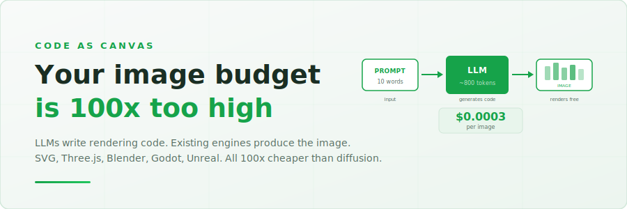

<p align="center">
  
</p>

<p align="center">
  
  
  
  
</p>

<p align="center">
  <b>LLMs write rendering code. Existing engines produce the image. 2–50x cheaper than diffusion.</b>
</p>

<p align="center">
  <a href="#quick-start">Quick start</a> · <a href="#the-renderer-spectrum">Renderer spectrum</a> · <a href="#examples">Examples</a> · <a href="#cost-comparison">Costs</a> · <a href="#live-demo">Live demo</a> · <a href="#articles">Articles</a>
</p>

<p align="center">
  <a href="https://labs.p.awsnavigator.com/code-as-canvas/demo.html"></a>
</p>

<p align="center">
  
</p>

## Why this exists

Image generation APIs charge $0.02-0.20 per image. For diagrams, charts, illustrations, data visualizations, and even 3D scenes, that math never made sense. The LLM already knows how to write SVG, HTML Canvas, Three.js, Blender Python, and Godot scene files. The renderers already exist and cost nothing.

This repo proves the thesis with working examples across the full renderer spectrum:

- 🎯 **$0.0003/image for simple SVG** (Flash-tier model, ~800 tokens): one LLM call, browser renders for free. Complex illustrations on Opus/Fable cost $0.09–$0.38 per image — still editable and deterministic, but comparable to diffusion pricing. The sweet spot is mid-complexity work on efficient models.
- 🎨 **8-plate editorial series**: consistent visual system from a single style document
- 📊 **Parameterized templates**: change data, not prompts. Infinite variants from one generation
- 🏗️ **Architecture diagrams that open in draw.io**: 270+ verified AWS icon mappings
- 🌐 **3D scenes for $0.001**: Three.js, Blender, Godot accept code input
- 🎬 **Animated content**: SVG animations, Remotion video, Manim math explainers
- ✅ **100% text accuracy**: code specifies text, never hallucinates it
- 🔄 **Version-controllable**: every image is source code you can diff, branch, and merge

## Quick start

> **Prerequisites**: Any LLM API (Claude, GPT-4, Gemini). A browser.

```bash
# Clone and open any example
git clone https://github.com/vidanov/llm-programmatic-image-gen.git
cd llm-programmatic-image-gen

# Open the interactive demo
open examples/demo.html

# Or open any standalone visual
open examples/threejs-crystal-garden.html
open examples/particle-universe.html
```

No build step. No dependencies. Every HTML file is self-contained.

## The renderer spectrum

Same pattern at every tier. LLM writes code, renderer produces the visual. Token cost grows linearly while capability grows exponentially. Cost is output tokens times model rate, so the figures below use Claude Sonnet 5; on Amazon Nova or Haiku they drop 3-10x, on Opus or Fable they rise.

| Renderer | Tokens | Cost (Sonnet) | Capability | Requires |
|----------|--------|------|------------|----------|
| **SVG** (browser) | ~800 | ~$0.01 | 2D vector, animations | Browser |
| **p5.js** (browser) | ~1,500 | ~$0.02 | Creative/generative art | Browser |
| **Canvas 2D** (browser) | ~2,400 | ~$0.04 | Particles, simulations | Browser |
| **Three.js** (browser) | ~3,000 | ~$0.05 | 3D scenes, PBR, WebGL | Browser |
| **Manim** (Python) | ~2,000 | ~$0.03 | Math animations, video | Python + ffmpeg |
| **Godot** (.tscn) | ~2,500 | ~$0.04 | Game scenes, 2D/3D | Godot (free, MIT) |
| **Blender** (Python) | ~5,000 | ~$0.08 | Photorealistic 3D | Blender CLI |
| **Unreal Engine 5** | ~8,000 | ~$0.12 | AAA-grade real-time | UE5 Editor |

An Unreal-grade frame at ~$0.12 on Sonnet (or ~$0.03 on a budget model) still beats GPT Image 1.5 at $0.02-0.20, and the output is editable source.

**Animation libraries** sit alongside these renderers as power-ups, not separate tiers:

| Library | LLM-friendly? | Role |
|---------|---------------|------|
| **GSAP** | ✅ Yes (JS) | Timelines, easing, scroll-triggers for SVG/Canvas/DOM |
| **Lottie** | ⚠️ Marginal | Cross-platform animation JSON, but verbose (~10-50K tokens) |
| **Rive** | ❌ No | Binary .riv format, not writable by LLM |

GSAP is the natural fit: the LLM writes a `<script>` tag with GSAP calls, SVG gets buttery animation. Lottie works if you need iOS/Android parity but burns tokens. Rive requires a visual editor, so it falls outside the code-as-image thesis.

## Examples

| Example | What it shows | Tokens | Open |
|---------|---------------|--------|------|
| [Editorial illustrations](examples/editorial/) | 8-plate series, one style doc | ~1,200/plate | [SVGs](examples/editorial/) |
| [Parameterized chart](examples/demo.html#live) | Drag sliders, SVG re-renders | ~1,000 | [Demo](https://labs.p.awsnavigator.com/code-as-canvas/demo.html#live) |
| [Three.js crystal garden](examples/threejs-crystal-garden.html) | Interactive 3D, bloom, orbits | ~3,200 | [Live](https://labs.p.awsnavigator.com/code-as-canvas/threejs-crystal-garden.html) |
| [Particle universe](examples/particle-universe.html) | Canvas 2D, 3 galaxies, 2600 particles | ~2,400 | [Live](https://labs.p.awsnavigator.com/code-as-canvas/particle-universe.html) |
| [Neural network](examples/neural-network-viz.svg) | 4 layers, animated signals | ~2,800 | SVG |
| [Isometric data center](examples/isometric-data-center.svg) | Server racks, data flows, LEDs | ~2,400 | SVG |
| [Circuit board hero](examples/circuit-board-hero.svg) | Blog hero, animated signals | ~2,200 | SVG |
| [Procedural landscape](examples/procedural-landscape.svg) | Parallax mountains, fireflies | ~1,600 | SVG |
| [Flow field](examples/generative-flow-field.svg) | Self-drawing curves, particles | ~1,800 | SVG |
| [Math animation](examples/manim-sine-wave.svg) | Sine wave with animated tracer | ~2,000 | SVG |
| [AWS architecture](examples/demo.html#archdiagram) | draw.io, 270+ verified icons | ~850 | [Live](https://labs.p.awsnavigator.com/code-as-canvas/demo.html#archdiagram) |

## Cost comparison

At 10,000 images per month (measured on Amazon Bedrock):

| Method | Cost/image | Monthly total | Editable | Deterministic | Quality |
|--------|-----------|---------------|----------|---------------|---------|
| GPT Image 1.5 | $0.034 | **$340** | No | No | High |
| Nano Banana 2 (Google) | $0.067 | **$670** | No | No | High |
| gpt-image-1-mini | $0.011 | **$110** | No | No | Medium |
| **Template + script (no LLM)** | $0.000 | **$0** | Yes | Yes | Fixed design |
| **LLM to SVG, Amazon Nova Pro** | $0.004 | **$40** | Yes | Yes | Primitive |
| **LLM to SVG, Claude Haiku 4.5** | $0.014 | **$140** | Yes | Yes | Decent |
| **LLM to SVG, Claude Sonnet 5** | ~$0.05 | **$500** | Yes | Yes | Good |
| **LLM to SVG, Claude Opus 4.8** | ~$0.10 | **$1,000** | Yes | Yes | Polished |

**The honest picture:** cheap models (Nova, Haiku) produce valid but visually primitive SVG. They work for simple diagrams and template-filling, not editorial illustration. For production-quality creative visuals, you need Sonnet or above, which puts you at $0.05–0.10/image: still cheaper than diffusion, but not 100x cheaper. The real win is editability and determinism, not just cost.

The sweet spot: **templates designed once by a frontier model (or human), filled repeatedly by a cheap model or plain script.** One $0.10 design pass, then 10,000 fills at $0.00 each.

## Live demo

The full interactive demo is deployed at:

**[labs.p.awsnavigator.com/code-as-canvas](https://labs.p.awsnavigator.com/code-as-canvas/index.html)**

Includes: cost calculator, live SVG generation with sliders, editorial gallery, architecture diagrams, hybrid photo+overlay examples, a game engine gallery with animated visuals, and model benchmarks.

The [presentation](https://labs.p.awsnavigator.com/code-as-canvas/presentation.html) (Reveal.js) covers the full thesis with speaker notes.

## Benchmarks

Same prompt ("crayon-style illustration of a boy with a cat"), across the Amazon Bedrock lineup:

| Model | Time | Tokens (in/out) | Cost | Quality |
|-------|------|-----------------|------|---------|
| Amazon Nova Pro | 6.7s | 84 / 1,102 | $0.004 | Valid but primitive |
| Claude Haiku 4.5 | 16.7s | 94 / 3,419 | $0.014 | Structured, decent |
| Claude Sonnet 5 | 48.6s | 450 / 6,128 | $0.093 | Good, minor filter issue |
| Claude Opus 4.8 | 47.7s | 450 / 4,089 | $0.105 | Fastest frontier, cleanest |
| Claude Opus 4.6 | 69.1s | 322 / 6,437 | $0.163 | Most complete scene |
| Claude Fable 5 | 100.0s | 450 / 7,531 | $0.381 | Sophisticated, slow |

A 106x cost range on one prompt, and quality tracks it: cheap is primitive, frontier is polished. Sweet spot for rich art is **Opus 4.8** at $0.105; **Nova/Haiku** own the cheap diagram floor. Multi-pass consistency results in `benchmarks/`.

## How it works

The pipeline is three steps:

1. **Prompt** (10 words): "cloud architecture diagram, 6 AWS services"
2. **LLM generates code** (~800 tokens, 2s): SVG markup, JavaScript, Python, or scene definition
3. **Renderer produces image** (0ms for browser, seconds for Blender): the output is editable source code

The LLM pays for tokens. The renderer is free. Every output is diffable, scalable, deterministic.

## When NOT to use this

| Need | Use this | Use diffusion |
|------|----------|---------------|
| Diagrams, charts, data viz | ✅ | Overkill |
| Illustrations with consistent style | ✅ | If photorealistic needed |
| Architecture/system diagrams | ✅ | Never |
| Photorealistic people/scenes | ❌ | ✅ |
| Artistic styles requiring pixel-level texture | ❌ | ✅ |
| Quick one-off creative exploration | Maybe | ✅ Faster iteration |
| Production batch (1000+ images) | ✅ 100x savings | Expensive |

## Articles

This repo accompanies a dev.to article series ("Code as Canvas"). Start with the framework, then the deep-dives:

0. Code or Diffusion? A Field Guide to Programmatic Image Generation *(coming soon)*
1. The $0.0003 Diagram: When to Fire Your Image API (and When Not To) *(coming soon)*
2. One Style Document, 8 Editorial Plates *(coming soon)*
3. Architecture Diagrams That Don't Break: 270+ Verified AWS Stencils *(coming soon)*
4. From SVG to Unreal: One Bedrock Call, Eight Renderers *(coming soon)*
5. Same Prompt, Four Models, Three Passes: How Deterministic Is "Deterministic"? *(coming soon)*

Links will be added as articles are published.

## Project structure

```
.
├── examples/
│   ├── demo.html                    # Full interactive demo (self-contained)
│   ├── presentation.html            # Reveal.js slide deck
│   ├── threejs-crystal-garden.html  # Three.js 3D scene
│   ├── particle-universe.html       # Canvas 2D particle simulation
│   ├── editorial/                   # 8-plate SVG illustration series
│   ├── generative-flow-field.svg    # Animated flow visualization
│   ├── manim-sine-wave.svg          # Math animation
│   ├── isometric-data-center.svg    # Isometric server scene
│   ├── neural-network-viz.svg       # Neural network visualization
│   ├── circuit-board-hero.svg       # Blog hero (2:1)
│   └── procedural-landscape.svg     # Night landscape with parallax
├── benchmarks/
│   ├── crayon-comparison/           # 4-model SVG benchmark results
│   └── multi-pass/                  # Consistency test (3 passes each)
├── docs/
│   ├── hero-banner.svg              # Repo hero image
│   ├── terminal-demo.svg            # Animated terminal demo
│   └── social-preview.svg           # 1280x640 social card
├── skills/
│   └── programmatic-viz.md          # Drop-in LLM skill (Claude/Kiro/agents)
└── README.md
```

## LLM Skill

The [`skills/programmatic-viz.md`](skills/programmatic-viz.md) file is a drop-in instruction set for any LLM. Paste it into:

- **Claude Projects** as custom instructions
- **Kiro** as `.kiro/skills/programmatic-viz/SKILL.md`
- **Any agent framework** as a system prompt

It teaches the model to route visual requests correctly (diffusion vs. code), select the cheapest renderer, and generate self-contained output files. No dependencies, no API keys required for the code-generation path.

## Contributing

Ideas for contributions:

- Add a Blender Python example (product visualization or architectural render)
- Add a Godot .tscn scene example
- Add a Manim video generation example
- Benchmark more models (Gemini Flash, GPT-4o)
- Port the interactive demo to other frameworks
- Add cost calculator for custom token rates

See [CONTRIBUTING.md](CONTRIBUTING.md) for guidelines.

## License

MIT. Created by [Alexey Vidanov](https://github.com/vidanov).

Built with Claude on [AWS Bedrock](https://aws.amazon.com/bedrock/). Every visual in this repo was generated programmatically. No diffusion model was called. No pixel was guessed.

---

<p align="center">
  <a href="https://www.linkedin.com/in/vidanov/">LinkedIn</a> · <a href="https://github.com/vidanov">GitHub</a> · <a href="https://dev.to/vidanov">dev.to</a>
</p>
